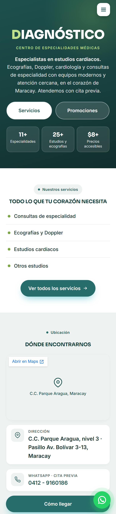
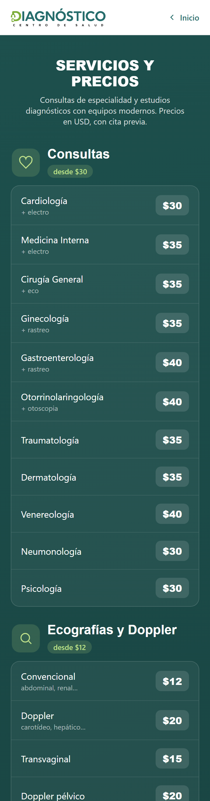
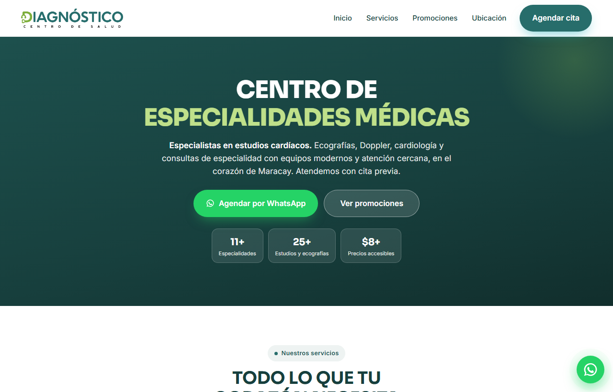

# Diagnóstico — Medical Center Landing Page

A fast, mobile-first landing page for **Diagnóstico · Centro de Salud**, a
diagnostic medical center in Maracay, Venezuela. It replaces the clinic's
previous link-in-bio (Taplink) with a self-hosted site that showcases their
services, prices and promotions, and turns visitors into appointments through
WhatsApp.

**🔗 Live demo:** https://diagnosticocentrodesalud.vercel.app


---

## Screenshots

| Mobile — Home | Mobile — Services |
| :---: | :---: |
|  |  |

**Desktop — Home**



---

## About

Diagnóstico is a real clinic that needed a professional presence to share on
Instagram (`@diagnostico.mcy`) and WhatsApp. The brief was a clean, modern,
**mobile-first** site — most patients open the link on their phone — that:

- Presents specialties, imaging/cardiac studies and transparent USD pricing.
- Makes booking a single tap away via WhatsApp.
- Reads comfortably for an **older audience**, who make up a large share of the
  clinic's patients.

The result is a single self-contained site with no framework and no build
step, deployed on Vercel.

## Features

- **Mobile-first, fully responsive** — designed for phones first, then scaled up
  to tablet and desktop with two breakpoints.
- **Brand-first hero** — the mobile hero leads with the DIAGNÓSTICO wordmark; the
  header is transparent over the hero and turns into a solid white bar with the
  logo on scroll (fixed navbar + a tiny scroll listener).
- **Dedicated pages** — the full price list (`servicios.html`) and promotions
  (`promociones.html`) live on their own pages, keeping the home page short on
  mobile while staying rich on desktop.
- **Accessibility for older users** — large type, high-contrast text, 44px+ touch
  targets and a tap-to-call phone number (`tel:` link).
- **WhatsApp-driven conversion** — a floating WhatsApp button plus contextual CTAs
  that pre-fill the message for each service/promotion.
- **SEO & social sharing** — descriptive meta tags and Open Graph tags with an
  absolute image, so shared links render a rich preview.
- **Graceful degradation** — reveal animations and the scroll-aware navbar are
  progressive enhancements; the content is fully usable without JavaScript.

## Tech stack

- **HTML5** — semantic, hand-written markup.
- **CSS3** — inlined in each page, using custom properties (design tokens),
  Flexbox and CSS Grid, fluid typography with `clamp()`, and mobile-first media
  queries. No CSS framework.
- **Vanilla JavaScript** — a few kilobytes for the hamburger menu, the
  scroll-aware header and `IntersectionObserver` reveal animations.
- **External services** — Google Fonts (Sora + Inter) and an embedded Google Map.
- **Hosting** — [Vercel](https://vercel.com) (static, zero-config).

No bundler, no dependencies, no `node_modules` — the repository is the site.

## Project structure

```
.
├── index.html          # Home (hero, services teaser, promotions, location, footer)
├── servicios.html      # Full services & prices, grouped by category
├── promociones.html    # Promotions / bundle offers
├── img/                # Logos, favicon and imagery
└── docs/screenshots/   # Images used in this README
```

## Engineering highlights

A few decisions that shaped the project:

- **One design system, three pages.** Colors, spacing and components are defined
  once as CSS custom properties and reused across pages, keeping the look
  consistent without a build tool.
- **Content adapts to the device, not just the layout.** On mobile the long
  price list and the promotions section are moved to dedicated pages and replaced
  by compact teasers, so the home page stays short and scannable; on desktop the
  same sections render inline.
- **Transparent-to-solid navbar without a library.** The header is `position:
  fixed` and transparent over the hero so the blue background reaches the top;
  a passive scroll listener toggles a `.scrolled` class to reveal the white bar
  and logo — and it falls back to a solid header when JS is unavailable.
- **Accessibility treated as a requirement, not a nice-to-have.** Type sizes,
  contrast ratios and touch-target sizes were audited specifically for older
  users.

## Running locally

No install step. Clone the repo and serve the folder with any static server:

```bash
# Python 3
python -m http.server 5500
# then open http://127.0.0.1:5500
```

Opening `index.html` directly works too, but a local server is recommended so
the Google Fonts and Maps requests behave as in production.

## Deployment

The site is deployed on **Vercel** as a static project (no build command, output
directory = repository root). Every push to `main` triggers an automatic
redeploy.

## Brand

- **Name:** DIAGNÓSTICO · Centro de Salud — Maracay, Aragua (Venezuela)
- **Colors:** deep teal `#173f3d`, lime green `#7BA845`, soft turquoise tints
- **Fonts:** Sora (display) + Inter (text)

---

<sub>Built as a real client project. The site content is in Spanish; this
documentation is in English.</sub>
